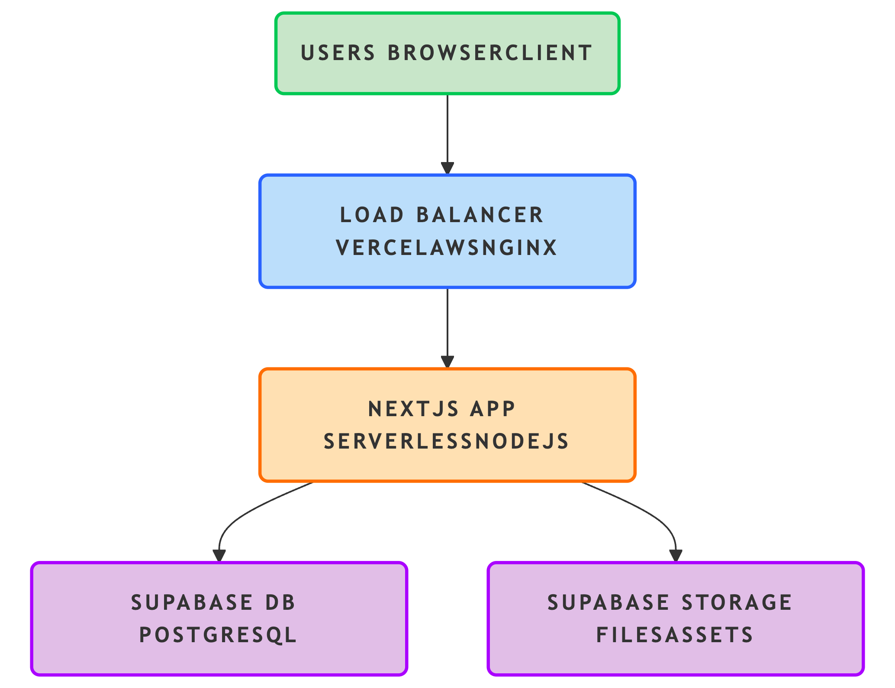

### Built With

The product is built using cutting-edge front-end technologies **NEXT.JS v15** & **REACT v19**.

Below are the list of tech stack used

- [![Next][Next.js]][Next-url]
- [![React][React.js]][React-url]
- [![ReactQuery][ReactQuery]][ReactQuery-url]
- [![Axios][Axios]][Axios-url]
- [![Tailwind][TailwindCSS]][TailwindCSS-url]

<!-- GETTING STARTED -->

## Getting Started

🚀 Follow these steps to get the project running locally.

### Prerequisites

Ensure you have the following installed on your local:

- **Node verison >= 20.15.0**

- **pnpm Package Manager**: for fast, disk space-efficient package manager. Install it globally using:

    ```sh
    npm i -g pnpm
    ```

### Running the Project Locally

1. Start the development server:

    ```sh
    pnpm run dev
    ```

    _This will launch the application in your browser at http://localhost:3000._

### Create Build for Production:

1. To create a production-ready build:

    ```sh
    pnpm run build
    ```

## Folder Structure

_The project follows a modular and scalable folder structure for better maintainability and clarity:_

```sh
└── hbc-fe/                    # Root directory
    ├── src/                   # Core source code
    │   ├── apis/              # API endpoint definitions anquery functions
    │   ├── app/               # App directory (Next.js 13+ routing)
    │   │   ├── auth/          # Authentication-related routes and logic
    │   │   ├── dashboard/     # Dashboard-specific routes
    │   │   ├── user/          # User-related pages and features
    │   │   ├── error.js       # Custom error boundary
    │   │   ├── favicon.ico    # Favicon for the app
    │   │   ├── layout.jsx     # Global layout for app pages
    │   │   ├── loading.js     # Loading UI fallback
    │   │   ├── not-found.js   # Custom 404 page
    │   │   └── page.jsx       # Root landing page
    │   ├── assets/            # Static media and visual assets
    │   │   ├── gifs/
    │   │   ├── images/
    │   │   ├── lotties/
    │   │   ├── svgs/
    │   │   └── webp/
    │   ├── components/        # Reusable UI components
    │   ├── config/            # Project-wide configuration settings
    │   ├── constant/          # Constants used across the app
    │   ├── design/            # Design tokens and styling utilities
    │   ├── enums/             # Enum definitions for app logic
    │   ├── hooks/             # Custom React hooks
    │   ├── interceptor/       # Axios or API interceptors
    │   ├── keys/              # Key mappings or identifiers
    │   ├── libs/              # External libraries or utilities
    │   ├── pathname/          # Centralized path definitions
    │   ├── rbac/              # Role-based access control logic
    │   ├── services/          # Business logic and API service functions
    │   ├── store/             # State management (e.g., Zustand, Redux)
    │   ├── styles/            # Global and scoped styles (Tailwind, SCSS, etc.)
    │   ├── utils/             # Helper functions and utilities
    │   ├── validations/       # Validation schemas and rules (e.g., Yup)
    │   └── middleware.js      # Middleware functions for route protection

```

<!-- MARKDOWN LINKS & IMAGES -->

[product-screenshot]: ./src/assets/images/product-screenshot.png
[Next.js]: https://img.shields.io/badge/next.js-000000?style=for-the-badge&logo=nextdotjs&logoColor=white
[Next-url]: https://nextjs.org/
[React.js]: https://img.shields.io/badge/React-20232A?style=for-the-badge&logo=react&logoColor=61DAFB
[React-url]: https://reactjs.org/
[Vue.js]: https://img.shields.io/badge/Vue.js-35495E?style=for-the-badge&logo=vuedotjs&logoColor=4FC08D
[Vue-url]: https://vuejs.org/
[Angular.io]: https://img.shields.io/badge/Angular-DD0031?style=for-the-badge&logo=angular&logoColor=white
[Angular-url]: https://angular.io/
[Svelte.dev]: https://img.shields.io/badge/Svelte-4A4A55?style=for-the-badge&logo=svelte&logoColor=FF3E00
[Svelte-url]: https://svelte.dev/
[Laravel.com]: https://img.shields.io/badge/Laravel-FF2D20?style=for-the-badge&logo=laravel&logoColor=white
[Laravel-url]: https://laravel.com
[Bootstrap.com]: https://img.shields.io/badge/Bootstrap-563D7C?style=for-the-badge&logo=bootstrap&logoColor=white
[Bootstrap-url]: https://getbootstrap.com
[JQuery.com]: https://img.shields.io/badge/jQuery-0769AD?style=for-the-badge&logo=jquery&logoColor=white
[JQuery-url]: https://jquery.com
[Antdesign]: https://img.shields.io/badge/Ant%20Design-20232A?style=for-the-badge&logo=antdesign&logoColor=0170FE
[Antdesign-url]: https://ant.design
[ReactQuery]: https://img.shields.io/badge/React%20Query-20232A?style=for-the-badge&logo=reactquery&logoColor=FF4154
[ReactQuery-url]: https://tanstack.com/query/latest
[Formik]: https://img.shields.io/badge/formik-20232A?style=for-the-badge&logo=formik&logoColor=2563EB
[Formik-url]: https://formik.org/
[Zustand]: https://img.shields.io/badge/Zustand-20232A?style=for-the-badge&logoColor=2563EB
[Yup]: https://img.shields.io/badge/Yup-20232A?style=for-the-badge&logoColor=2563EB
[Chart.js]: https://img.shields.io/badge/chart.js-20232A?style=for-the-badge&logo=chartdotjs&logoColor=FF6384
[Chartjs-url]: https://www.chartjs.org/docs/latest/
[Axios]: https://img.shields.io/badge/axios-20232A?style=for-the-badge&logo=axios&logoColor=5A29E4
[Axios-url]: https://axios-http.com/docs/intro
[TailwindCSS]: https://img.shields.io/badge/tailwind-20232A?style=for-the-badge&logo=tailwindcss&logoColor=06B6D4
[TailwindCSS-url]: https://tailwindcss.com/blog/tailwindcss-v4

## Application Architecture

This section describes the production-level architecture for this application.

**1: Title**

- Application Architecture – Firmable Assignment
- Production-Ready Next.js + Supabase Deployment

**2: Overview**

- Framework: Next.js (React, SSR/SSG)
- API Layer: Next.js API routes
- Database: Supabase (PostgreSQL)
- State Management: React Query
- Styling: Tailwind CSS
- Deployment: Vercel/AWS

**3: High-Level Architecture Diagram**

- (Insert diagram – see below for a ready-to-use diagram)
- Description: Shows user flow from browser to load balancer, Next.js app, and Supabase services.

**4: Key Components**

- Next.js App: Handles SSR, static pages, API endpoints.
- Supabase: Managed PostgreSQL, authentication, storage.
- React Query: Efficient client-side data fetching/caching.
- Tailwind CSS: Utility-first styling.
- API Security: Environment variables, CORS, HTTPS.

**5: DevOps & Security**

- CI/CD: GitHub Actions or Vercel/Git integration.
- Environment Management: .env files for secrets.
- Monitoring: Vercel/Supabase dashboards.
- Scaling: Serverless deployment.
- Backups: Supabase automated backups.

**6: Deployment Flow**

- Diagram: Developer → GitHub → CI/CD → Vercel/AWS → Production
- Zero-downtime Deployments
- Environment Variables managed in deployment platform

## System Architecture



_The diagram above illustrates the production deployment architecture for this application, including user access, load balancing, Next.js app, and Supabase services._
